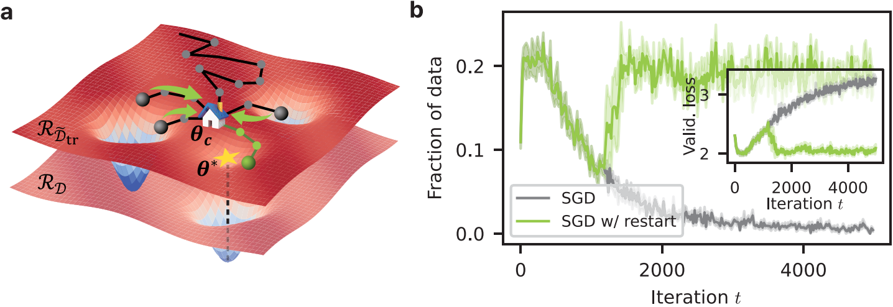

# Stochastic Resetting Mitigates Latent Gradient Bias of SGD from Label Noise

[](https://iopscience.iop.org/article/10.1088/2632-2153/adbc46)
[](https://arxiv.org/abs/2406.00396v3)

Authors: Youngkyoung Bae<sup>\*</sup>, Yeongwoo Song<sup>\*</sup>, and Hawoong Jeong<br>
<sub> \* Equal contribution</sub>


This repository contains the official implementation of ``Stochastic Resetting Mitigates Latent Gradient Bias of SGD from Label Noise``, published in [Machine Learning: Science and Technology](https://iopscience.iop.org/article/10.1088/2632-2153/adbc46).

## Summary
Giving up and starting over may seem wasteful in many situations such as searching for a target or training deep neural networks (DNNs). Our study, though, demonstrates that resetting from a checkpoint can significantly improve generalization performance when training DNNs with noisy labels. In the presence of noisy labels, DNNs initially learn the general patterns of the data but then gradually memorize the corrupted data, leading to overfitting. By deconstructing the dynamics of stochastic gradient descent (SGD), we identify the behavior of a latent gradient bias induced by noisy labels, which harms generalization. To mitigate this negative effect, we apply the stochastic resetting method to SGD, inspired by recent developments in the field of statistical physics achieving efficient target searches. We first theoretically identify the conditions where resetting becomes beneficial, and then we empirically validate our theory, confirming the significant improvements achieved by resetting. We further demonstrate that our method is both easy to implement and compatible with other methods for handling noisy labels. Additionally, this work offers insights into the learning dynamics of DNNs from an interpretability perspective, expanding the potential to analyze training methods through the lens of statistical physics.

<center></center>

## Getting started

We implemented our algorithm (basically) with ``Python 3.10.13`` and ``PyTorch==1.10.2``.

```
git clone https://github.com/qodudrud/LBN.git
```

## Datasets

We use the following datasets in our experiments:

- ciFAIR-10
  - Paper: [Image Classification with Small Datasets: Overview and Benchmark](https://ieeexplore.ieee.org/abstract/document/9770050)
  - Link: [Github](https://github.com/lorenzobrigato/gem) (note that we manually included this repo in our code.)
- CIFAR-10/100
  - Paper: [Learning multiple layers of features from tiny images](https://www.cs.utoronto.ca/~kriz/learning-features-2009-TR.pdf)
  - Link: [cifar-10/100](https://www.cs.toronto.edu/~kriz/cifar.html)
- CIFAR-10N/100N
  - Paper: [Learning with Noisy Labels Revisited: A Study Using Real-World Human Annotations](https://openreview.net/forum?id=TBWA6PLJZQm&referrer=%5BAuthor%20Console%5D(%2Fgroup%3Fid%3DICLR.cc%2F2022%2FConference%2FAuthors%23your-submissions))
  - Link: [Github](https://github.com/UCSC-REAL/cifar-10-100nhttps://noisylabels.com)
- ANIMAL-10N
  - Paper: [SELFIE: Refurbishing Unclean Samples for Robust Deep Learning](http://proceedings.mlr.press/v97/song19b.html)
  - Link: [animal-10n official homepage](https://dm.kaist.ac.kr/datasets/animal-10n/)

Download the datasets and put them inside the `data` folder.

For convenience, we share the collections of the above datasets through the following link; [link to the collections](https://www.dropbox.com/scl/fi/wyuwhr5kld7y0erv445tx/resetting_data_collection.zip?rlkey=eldhhz3j8ehi3pjk62c59h6o0&st=m5ln0a9v&dl=0)

## Execution

You can train the models by running the file ``main.py``. Below, we provide an example.

```
python -u main.py \
  --save-path results\
  --data cifar10 \
  --model resnet34 \
  --opt sgd \
  --best-metric loss \
  --opt-reset 1 \
  --tot-iter 50000 \
  --log-iter 10 \
  --lr 0.1 \
  --lr-schedule cosineannealing \
  --weight-decay 0.0005 \
  --batch-size 256 \
  --test-batch-size 4096 \
  --reset-prob 0.001 \
  --threshold-iter 5000 \
  --warmup-iter 0 \
  --momentum 0.9 \
  --seed 1 \
  --noise-rate 0.6 \
  --adaptive 1 \
  --loss-type ce \
```

## Bibtex
Cite the following BibTeX.
```bibtex
@article{bae2025stochastic,
  doi = {10.1088/2632-2153/adbc46},
  url = {https://dx.doi.org/10.1088/2632-2153/adbc46},
  year = {2025},
  month = {mar},
  publisher = {IOP Publishing},
  volume = {6},
  number = {1},
  pages = {015062},
  author = {Bae, Youngkyoung and Song, Yeongwoo and Jeong, Hawoong},
  title = {Stochastic resetting mitigates latent gradient bias of SGD from label noise},
  journal = {Machine Learning: Science and Technology},
}

```
